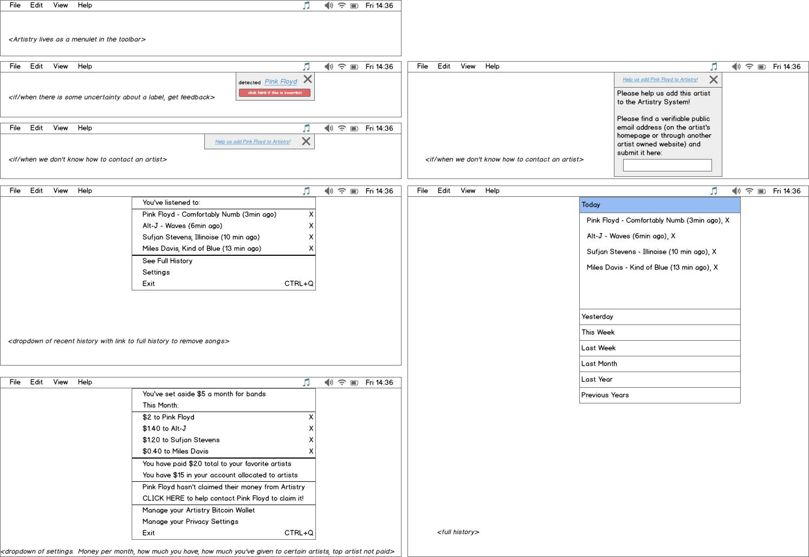

# Artistry

Artistry is an open platform to help music fans directly fund the artists that
they listen to and care about.

## How Does it Work?

Artistry identifies the music you play on your computer in the background, and
puts aside a small donation of your choosing every month to split between the
artists you listen to.

Until it is sent to an artist, this set-aside money is under your control.  You 
can see how your money is split (proportional to plays), and remove plays for
artists you'd rather not donate to, before it is distributed at the end of the
month.  If we can't verify an artist will receive your money, you retain
control of it (set aside in your Artistry wallet), until we *can* verify that artist.
As soon as we verify this artist, they receive the funds allocated to them.

Initially, artists aren't in the system.  We wanted to design a scalable,
decentralized way of verifying artist identity.  To that end, we are
crowd-sourcing reliable contact information for each artist from the fan
community through Artistry (asking users to find an appropriate public email address
or phone number for each artist).  Once enough redundancy from geographically
isolated fans results in consensus, that email address will serve as a point of
contact to inform the artist that they have money waiting for them in the Artistry
system, help them create a wallet, and finally provide us with a key (from that
verified address) for forwarding their tips.

Running on your computer is an audio-fingerprinting generator that talks to our
distributed content-id system (please help us by hosting a lookup server)!
This tracks the songs you play with a unique song id (from musicbrainz).  At
the end of the month, your money is split to the artists you've listened to,
and your songlist and timestamps are uploaded to the blockchain (if you've
opted in).  Opting in gives you access to other anonymized user data so you can
build new recommendation services and experiences with the shared data.

A mock-up is below.

## What about all of that data?

Cool side-effects of this design include:

(1) an open database of anonymous users and their music listening habits
(anonymized user id, a song id, and a timestamp of when it was played).  We
want to build an API on top of this so *anyone* can design an intelligent
recommender system based on real user data.  Open data and privacy are two very
important concerns.

We will design this system so you can opt-out of having the songs you play
stored in a blockchain for this purpose.  However, payments to artist bitcoin
wallets (while anonymized) are fully traceable, so using a system of this sort will
*still* give auditability into the artists that you are listening (and thus donating)
to.

(2) an open database of working, reputable contact information for artists.
This is integral to the platform because we need to crowd-source reputable contact
information for these artists so they can claim their money (and we naturally
verify they use this address by checking that it has been successfully used to
claim a wallet).

This could potentially be abused (for spamming artists), but it also could
provide interesting opportunities to reach out and connect many artists, and or
serve as a reputable address for other services that require artist identity
verification.

